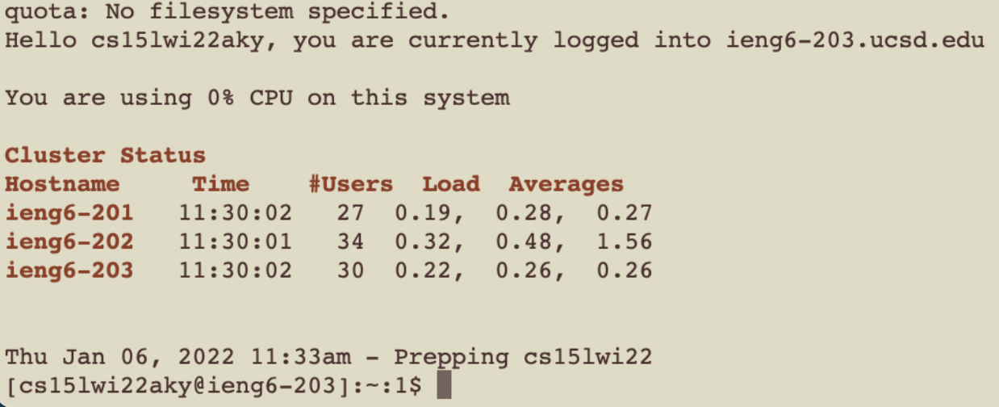

# Week 2 Lab Report - VS Code, SSH, and command-line tools
*Author: Matthew Tan*

## Step 1: Installing VS Code
Download Visual Studio Code 
<a href="https://code.visualstudio.com/download" target="_blank">here</a>. Once you've completed the installation, the VS Code launch screen should look something like this:  

## Step 2: Remotely Connecting
The next step is to reset the password to activate your course-specific account. Once you know your newly set password, enter the following command in your terminal, but replacing the "aky" with the letters in your course-specific account.
> ssh cs15lwi22aky@ieng6.ucsd.edu

You will then be prompted with a yes/no quesitoning whether or not to allow the connection.
> ssh cs15lwi22aky@ieng6.ucsd.edu
The authenticity of host 'ieng6.ucsd.edu (128.54.70.227)' can't be established.
RSA key fingerprint is SHA256:ksruYwhnYH+sySHnHAtLUHngrPEyZTDl/1x99wUQcec.
Are you sure you want to continue connecting (yes/no/[fingerprint])? 

Enter yes, then your password, and your connection will be initialized.

Once you've successfully established a connection, the output should look similar to the image below:

  

## Step 3: Trying Some Commands
The next step is to start triyng out some command-line commands and observe the output. Some useful commands to know are `cd`, `ls`, `pwd`, and `scp`.

  

## Step 4: Moving Files with scp
The `scp` (secure copy) command is useful for copying files and directories between two locations. The structure of this command is [`scp` + `file/directory` + `course-specific account` + `~/`]  The code block below illustrates how to copy a local file to your course-specfic account.
> scp HelloWord.java cs15lwi22aky@ieng6.ucsd.edu:~/

A screenshot of the line in terminal:

## Step 5: Setting an SSH Key
SSH keys are a great way to avoid having to enter your password each time you want to copy over files to the server. To generate your key, enter `ssh-keygen`. The output should look something like:

Now you should no longer have to re-enter your password each time you want to ssh or scp.

## Step 6: Optimizing Remote Running
Finally, there are a few tips to help you navigate the command-line tools more efficiently. The first (and my personal favorite) is using `up-arrow` in the command-line to automatically pull up your last-used command(s). Next, you can use any terminal command (in quotes) at the end of an ssh command to run it directly rather than having to type it out separately (see example below).

My final tip is to use semicolons to run multiple commands at once (see example below).

## Conclusions
This lab covered how to `connect to my course-specific account` using ssh, use `command-line tools` to view file info and copy them over, and taught me how to `utilize the command-line more efficiently`.