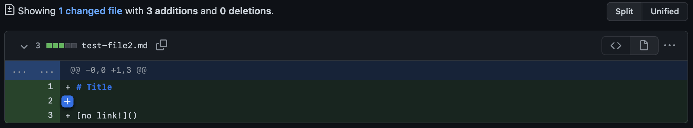
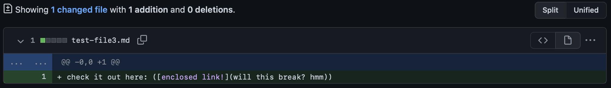

# Week 4 Lab Report - Incremental Programming and Debugging
*Author: Matthew Tan*

## Instructions
Pick three code changes that your group worked on in labs 3 and 4 in order to fix a bug; these should be stored as commits on someone’s repository. Fork the repository so you have your own copy with all the work your group did if you haven’t already.

For each of the three code changes:

- Show a screenshot of the code change diff from Github
- Link to the test file for a failure-inducing input that prompted you to make that change
- Show the symptom of that failure-inducing input by showing the output of running the file at the command line for the version where it was failing (this should also be in the commit message history)
- Write 2-3 sentences describing the relationship between the bug, the symptom, and the failure-inducing input.

### Code Change #1

[Test 1](https://github.com/Tantime/markdown-parse/commit/ef25323083aaa003c62c59b8d2f5ad4b3df34a3b)

### Code Change #2

[Test 2](https://github.com/Tantime/markdown-parse/commit/10452ee1127f00b75af2cd3884f7e2aa2caad09f)

### Code Change #3

[Test 3](https://github.com/Tantime/markdown-parse/commit/06f6858cacf895962624faf061035a0fab457926)