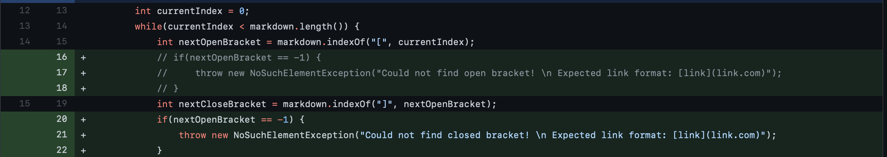

# Lab Report 2 - Incremental Programming and Debugging
*Author: Matthew Tan*

### Code Change #1
Added two conditional statements to catch bad input (in the case of this test file input, it is the **extra set of parentheses surrounding the link**), send an error message, and print out an example of the expected link format.

<a href="https://github.com/Tantime/markdown-parse/commit/10452ee1127f00b75af2cd3884f7e2aa2caad09f" target="_blank">link to test-file3.md</a>

Symptom:

The underlying bug was the conditional `currentIndex < markdown.length()` always being true causing a never-ending while loop in MarkdownParse's main method. The corresponding symptom was an infinite loop caused by the failure-inducing input of an md-formatted link enclosed in an **extra set of parentheses** in test-file3.md.

### Code Change #2
Added two more conditional statements to catch bad input (in the case of this test file input, it is the **extra set of brackets surrounding the link**), send an error message, and print out an example of the expected link format.

<a href="https://raw.githubusercontent.com/Tantime/markdown-parse/5ef0d5f8974af0d029001422cf50cfbedc429f73/test-file4.md" target="_blank">link to test-file4.md (shown as raw because github displays md-style formatting)</a>

Symptom:

The underlying bug was still the never-ending while loop in MarkdownParse's main method due to the conditional `currentIndex < markdown.length()` always evauluating to true. The symptom was an infinite loop caused by the failure-inducing input of an md-formatted link enclosed in an **extra set of brackets** in test-file4.md.

### Code Change #3
Added conditionals and error messages to handle bad user input.

<a href="https://github.com/Tantime/markdown-parse/blob/main/test-file5.md" target="_blank">link to test-file5.md</a>

Symptom:

The symptom in the case of test-file5.md was a StringIndexOutOfBoundsException being thrown when attempting to parse the given input. The bug causing the error was the `markdown.substring(openParen + 1, closeParen)` being given invalid, out-of-bounds arguments that result from bad user input.