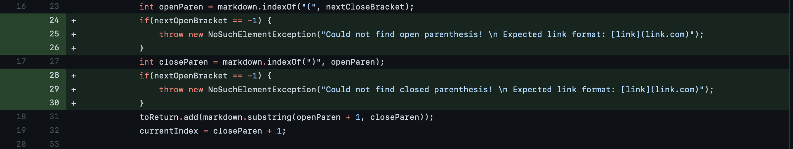

# Week 4 Lab Report - Incremental Programming and Debugging
*Author: Matthew Tan*

### Code Change #1
Added print statement to trace values of currentIndex.

<a href="https://github.com/Tantime/markdown-parse/commit/10452ee1127f00b75af2cd3884f7e2aa2caad09f" target="_blank">link to test-file3.md</a>

Symptom:

The symptom of an infinite loop was caused by the failure-inducing input of an md-formatted link enclosed in an extra set of parenthesis. The underlying bug was a never-ending while loop in MarkdownParse's main method due to the conditional `currentIndex < markdown.length()` always being true.

### Code Change #2
Added print statement to trace values of closeParen.

<a href="https://github.com/Tantime/markdown-parse/commit/10452ee1127f00b75af2cd3884f7e2aa2caad09f" target="_blank">link to test-file3.md</a>

Symptom:

The symptom was an infinite loop caused by the failure-inducing input of an md-formatted link enclosed in an extra set of parenthesis. The underlying bug was still the never-ending while loop in MarkdownParse's main method due to the conditional `currentIndex < markdown.length()` always evauluating to true.

### Code Change #3
Created JUnit tests to compare expected behavior with actual behavior.

<a href="https://github.com/Tantime/markdown-parse/commit/10452ee1127f00b75af2cd3884f7e2aa2caad09f" target="_blank">link to test-file3.md</a>

Symptom:

The symptom and bug was the same as in the first two examples, but the print statements we added earlier helped our lab group trace the values of `currentIndex` and `closeParen` while the program was running. With those values we were able to deduce that `closeParen` would always evaluate to -1 from calling `markdown.indexOf(")", openParen)`. The `indexOf` method evaluated to `-1` due to a domino effect initially caused by the program using the first parenthesis' index for `openParen`.