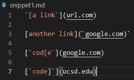
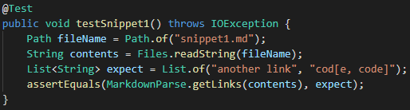
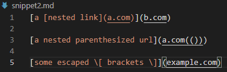
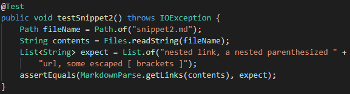
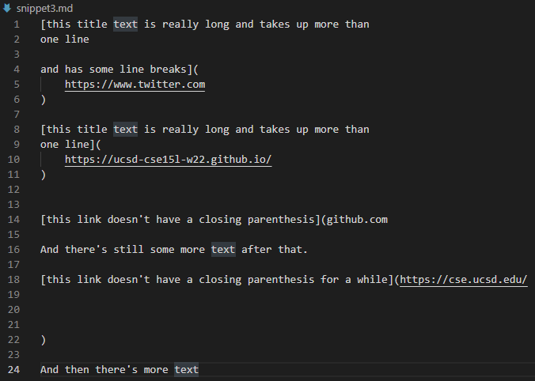
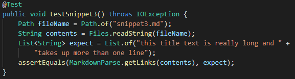
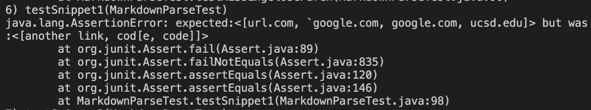
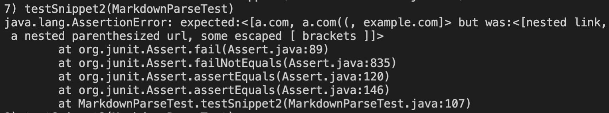
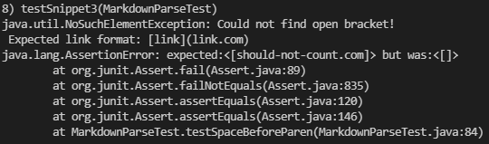

# Lab Report 4 - Additional Testers for markdown-parse
*Author: Matthew Tan*

 

Instructions:  
For each snippet, add a test both to your implementation of markdown-parse, and the implementation you reviewed in week 7. Run the tests and show the results of running the tests on each. This means you should add a total of 6 test methods (3 to your implementation and 3 to the one you reviewed).

## The snippets and their testers

<a target="_blank" rel="noopener noreferrer" href="https://github.com/Tantime/markdown-parse">Link to my markdown-parse repo</a>

 

In order to be able to observe how both my and the peer reviewed implementation of markdown-parse process the three snippets below, I created tester methods for each snippet. I used the <a target="_blank" rel="noopener norefferer" href="https://spec.commonmark.org/dingus/">CommonMark demo site</a> to see expected Markdown behavior.

### Snippet 1

Tester method for snippet 1:

 

### Snippet 2

Tester method for snippet 2:

 

### Snippet 3

Tester method for snippet 3:

 

## Running tests on my markdown-parse

First, I added the snippets as Markdown files and tried running all three tests on my implementation of the MarkdownParse class.

Snippet 1 Output:

Possible code change: 

Snippet 2 Output:

Possible code change:

Snippet 3 Output:

Possible code change:

 

## Running tests on reviewed markdown-parse

<a target="_blank" rel="noopener noreferrer" href="">Link to reviewed markdown-parse repo</a>

Just as I did for my implementation of MarkdownParse, I added the three snippets and corresponding tests on the version of MarkdownParse that we reviewed during lab in week 7.

Snippet 1 Output:

Possible code change: 

Snippet 2 Output:

Possible code change:

Snippet 3 Output:

Possible code change:

 