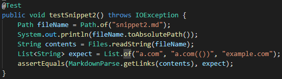
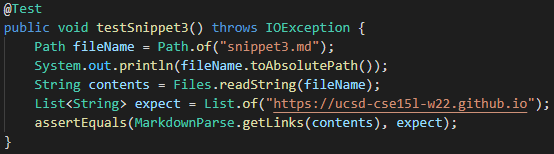
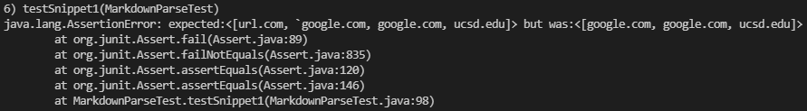
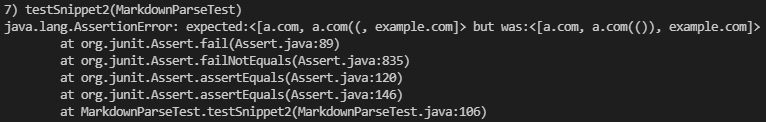
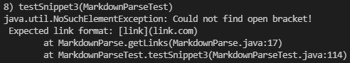

# Lab Report 4 - Additional Testers for markdown-parse
*Author: Matthew Tan*

 

Instructions:  
For each snippet, add a test both to your implementation of markdown-parse, and the implementation you reviewed in week 7. Run the tests and show the results of running the tests on each. This means you should add a total of 6 test methods (3 to your implementation and 3 to the one you reviewed).

## The snippets and their testers

<a target="_blank" rel="noopener noreferrer" href="https://github.com/Tantime/markdown-parse">Link to my markdown-parse repo</a>

 

In order to be able to observe how both my and the peer reviewed implementation of markdown-parse process the three snippets below, I created tester methods for each snippet. I used the <a target="_blank" rel="noopener norefferer" href="https://spec.commonmark.org/dingus/">CommonMark demo site</a> to see expected Markdown behavior.

### Snippet 1

Tester method for snippet 1:

 

### Snippet 2

Tester method for snippet 2:

 

### Snippet 3

Tester method for snippet 3:

 

## Running tests on my markdown-parse

First, I added the snippets as Markdown files and tried running all three tests on my implementation of the MarkdownParse class.

Snippet 1 Output:

Possible code change: 

The CommonMark demo site identified part of the first "link" as part of a code block, so the second half of the "link" was not a valid link. My code identified the first "link" as a valid link because I have nothing to identify code blocks. If I add a couple if statements to help identify the content between two backticks as a code block, my output would match that of the CommonMark demo site.

Snippet 2 Output:

Possible code change:

My code almost handled the input identically to the CommonMark demo site, but the exception was the second link `a.com(())`. After the first open parenthesis, once my code finds the next closed parenthesis it considers that to be the end of the link. A small change I could make would be to, in the case of consecutive closed parenthesis, only consider the final closed parenthesis to be the end of the link with a for loop.

Snippet 3 Output:

Possible code change:

One thing I noticed about the behavior shown on the CommonMark demo site was that links that has line breaks in them were not considered valid links. My code on the other hand does not do anything to handle line breaks, and this could lead to misleading errors. A small change I could make would be to run a check (with an if statement) for line breaks and treat them as a indication to reset the search for a new link.

 

## Running tests on reviewed markdown-parse

<a target="_blank" rel="noopener noreferrer" href="https://github.com/IncogOwl/markdown-parse/tree/197bb0413dbbb5c218a6605033fcfc30c74f5af1">Link to reviewed markdown-parse repo</a>

Just as I did for my implementation of MarkdownParse, I added the three snippets and corresponding tests on the version of MarkdownParse that we reviewed during lab in week 7.

Snippet 1 Output:

 

Snippet 2 Output:

 

Snippet 3 Output:

 