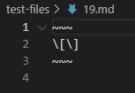
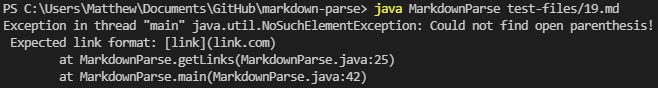
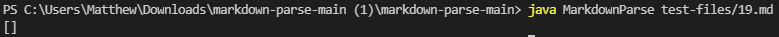
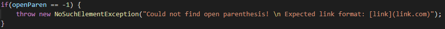
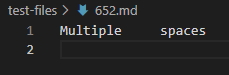
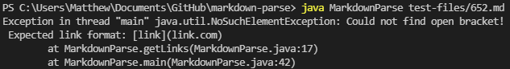
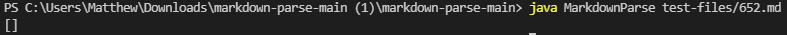

# Lab Report 5 - Analyzing Different Outputs
*Author: Matthew Tan*

## How did I find the tests with different results?

<a target="_blank" rel="noopener noreferrer" href="https://github.com/ucsd-cse15l-w22/markdown-parse/tree/main/test-files">Link to the commonmark-spec test files</a>

I found both of the tests with different results simply by manually checking outputs. Given that there were large differences in implementation, it did not take me very long to find different results between my lab group's version of MarkdownParse and the one we looked at in week 9.

## Analyzing Output - Test File 19
test-19:  
  
test-19 commonmark output:  

### 1. Which implementation was correct?
Output from my implementation:  

 

Output from given implementation:  

Comparing the outputs to the expected output, my implementation was incorrect while the given week 9 implementation was correct.

### 2. The bug behind the symptom(s):
The expected output was `[]`, but my `getLinks()` threw the `NoSuchElementException` shown above. The code responsible for the excpetion was the following conditional: 

The problem with this behavior is that once my code recognizes that there are brackets in the .md file, it assumes the user intends for there to be a link and will throw an exception if there are no corresponding parenthesis. However, brackets are used for many things other than links, so I need to change this conditional to be more specific in order to be able to replicate the expected output.

 

The week 9 implementation of MarkdownParse produced the correct output.

 

## Analyzing Output - Test File 652
test-652:  
  
test-19 commonmark output:  

### 1. Which implementation was correct?
Output from my implementation:  

 

Output from given implementation:  

As in the case of test 19, my implementation produced incorrect output while the week 9 implementation replicated the expected result.

### 2. The bug behind the symptom(s):
The expected output was `[]`, but my `getLinks()` threw the `NoSuchElementException` shown above. The code responsible for the excpetion was the following conditional: 

In this case, my code throws an error because it expects there to be a link, but there weren't any specifying brackets or parenthesis. If I change my code to start searching for links once it has seen an open bracket "`(`", followed by some text "`some text`", followed by a closed bracket plus an open parenthesis "`](`", then it won't throw a `NoSuchElementException` when the user did not intend for there to be a link.

Once again, the week 9 implementation of MarkdownParse produced the correct output.